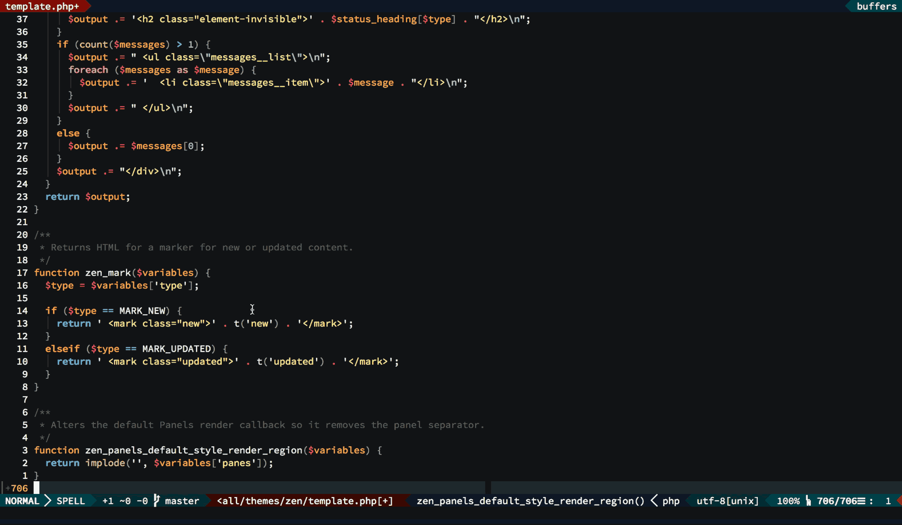
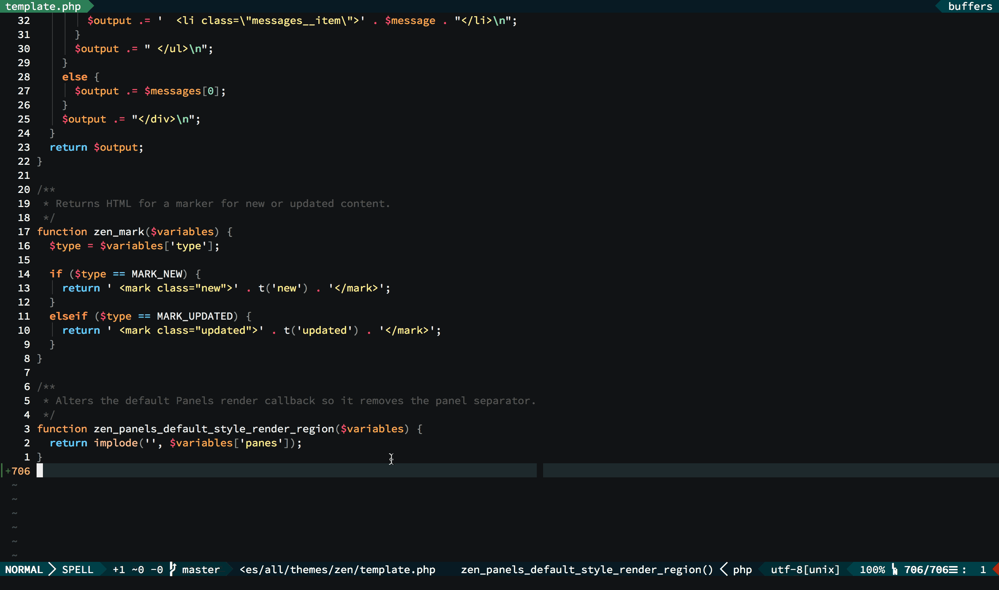

# Drupal Hook Generator for Vim

This Vim plugin provides a `GenerateDrupalHook` command, which generates a Drupal hook function based on tags, with optional support for [fzf.vim](https://github.com/junegunn/fzf.vim).


## Installation

Using [vim-plug](https://github.com/junegunn/vim-plug):

```vim
Plug 'jacks0n/Drupal-Hook-Generator.vim', { 'for': 'php' }
```

- Ensure [ctags](https://github.com/universal-ctags/ctags) is installed and all hook tags have been generated (see `:echo taglist('^hook_')` for all hook tags defined).
- Follow the [fzf.vim installation steps](https://github.com/junegunn/fzf.vim#installation) for FZF support (*optional*).
- Make sure to use Vim 7.4 or above.

## Usage

Generate ctags from the root of the code. Example:
```
ctags --langmap=php:.engine.inc.module.theme.install.php --php-kinds=cdfi --languages=php --recurse --fields=+aimlS
```

```vim
" Call the hook generator command directly.
:GenerateDrupalHook

" Mapping.
nmap <Leader>dh :GenerateDrupalHook<CR>
```


## Screencasts

### With [fzf.vim](https://github.com/junegunn/fzf.vim) enabled



### With [fzf.vim](https://github.com/junegunn/fzf.vim) disabled/uninstalled




## License

Copyright (c) Jackson Cooper.  Distributed under the [MIT license](LICENSE).
